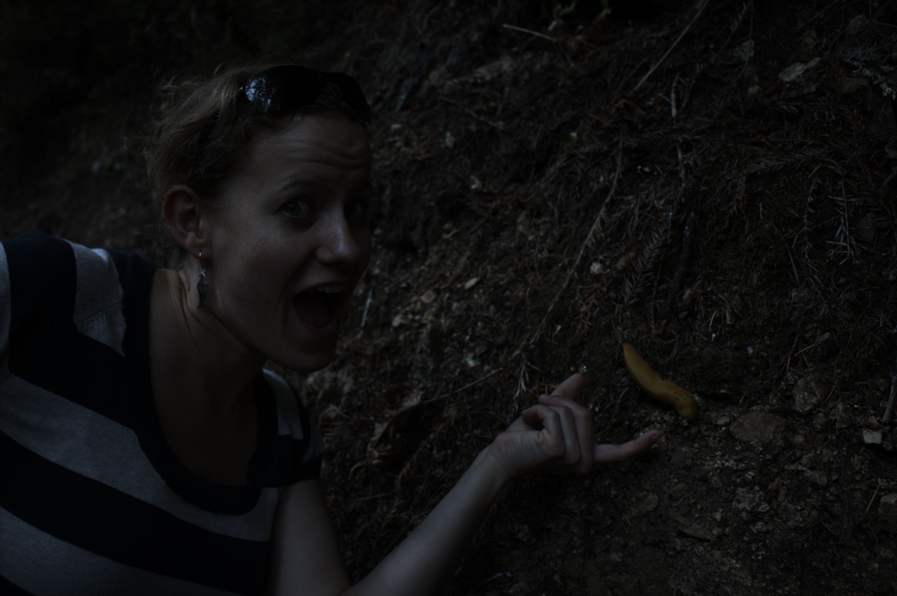

# Assignment 1  
## Implement a basic image processing pipeline  
### Initials

먼저 matlab의 imread 함수를 통해 banana_slug.tiff 파일을 불러온 뒤,  
tiff 파일이 2856 by 4290의 size를 가지는 것을 확인하였고,  
각 값이 uint16의 class를 가지는 것을 확인할 수 있었다.  
이를 확인한 뒤, 이미지를 double의 class를 가지도록 하였다.  
```matlab
clc; clear all;
RAW = imread('banana_slug.tiff');

sz = size(RAW);
className = class(RAW);
db = double(RAW);
```

### Linearization  

double의 형태를 가지는 이미지의 픽셀 중 15000 이상의 값을 가지는 픽셀은 1을,  
2047 이하의 값을 가지는 픽셀은 0을 가지도록 하고 그 중간을 linear하게 변환시켜주었다. 
```matlab
linear = zeros(sz(1), sz(2));
for n = 1:sz(1)
    for m = 1:sz(2)
        val = ((db(n, m) - 2047) / (15000 - 2047));
        if val < 0
            val = 0;
        elseif val > 1
            val = 1;
        end
        linear(n, m) = val;
    end
end
```

### Identifying the correct bayer pattern  

먼저 어떤 bayer pattern을 가지고 있는 지 확인하기 위해서 각 영역들의 값의 차이를 확인하였다.  
diff_12 = 81160, diff_13 = 80658, diff_14 = 22146, diff_23 = 14524, diff_24 = 76540, diff_34 = 76151의 값을 가지는 것을 확인하였다.  
따라서 diff_23의 값이 제일 작기 2번과 3번 영역이 초록색이라는 것을 확인할 수 있었다.  
그런 뒤, rggb인지 bggr인지 확인하기 위해 그 이미지를 출력하여 확인하였는데,  
rggb에서의 전체적인 이미지가 나타내는 색이 적절하여 rggb의 bayer pattern을 가진다는 것을 확인하였다.  
```matlab
lin1 = linear(1:2:end, 1:2:end);
lin2 = linear(1:2:end, 2:2:end);
lin3 = linear(2:2:end, 1:2:end);
lin4 = linear(2:2:end, 2:2:end);

diff_12 = sum(sum(abs(lin1 - lin2)));
diff_13 = sum(sum(abs(lin1 - lin3)));
diff_14 = sum(sum(abs(lin1 - lin4)));
diff_23 = sum(sum(abs(lin2 - lin3)));
diff_24 = sum(sum(abs(lin2 - lin4)));
diff_34 = sum(sum(abs(lin3 - lin4)));

green = (lin2 + lin3) .* 0.5;

lin_first = cat(3, lin1, green, lin4);
figure;
imshow(lin_first);
imwrite(lin_first, 'lin_first.png');

lin_second = cat(3, lin4, green, lin1);
figure;
imshow(lin_second);
imwrite(lin_second, 'lin_second.png');

lin_rgb = lin_first;
```
<table>
    <tr>
        <th>rggb</th>
        <th>bggr</th>
    </tr>
    <tr>
        <td></td>
        <td></td>
    </tr>
</table>

### White balancing  
#### Grey world assumption  


```matlab
lin_mean = mean(lin_rgb, [1 2]);
red_grey = lin1 .*(lin_mean(:, :, 2) / lin_mean(:, :, 1));
green_grey = green;
blue_grey = lin4 .*(lin_mean(:, :, 2) / lin_mean(:, :, 3));
rgb_grey = cat(3, red_grey, green_grey, blue_grey);

figure;
imshow(rgb_grey);
imwrite(rgb_grey, 'rgb_grey.png');
```

#### White world assumption  

```matlab
lin_max = max(lin_rgb, [], [1 2]);
red_white = lin1 .*(lin_max(:, :, 2) / lin_max(:, :, 1));
green_white = green;
blue_white = lin4 .*(lin_max(:, :, 2) / lin_max(:, :, 3));
rgb_white = cat(3, red_white, green_white, blue_white);

figure;
imshow(rgb_white);
imwrite(rgb_white, 'rgb_white.png');
```

<table>
    <tr>
        <th>Grey world assumption</th>
        <th>White world assumption</th>
    </tr>
    <tr>
        <td></td>
        <td></td>
    </tr>
</table>

### Demosaicing  
Use grey world assumption  

```matlab
red_demosaic = interp2(red_grey);
green_demosaic = interp2(green_grey);
blue_demosaic = interp2(blue_grey);
rgb_demosaic = cat(3, red_demosaic, green_demosaic, blue_demosaic);

figure;
imshow(rgb_demosaic);
imwrite(rgb_demosaic, 'rgb_demosaic.png');
```

<table>
    <tr>
        <th>Demosaicing</th>
    </tr>
    <tr>
        <td></td>
    </tr>
</table>

### Brightness adjustment and gamma correction  
#### Brightness adjustment  

```matlab
rgb_adj = rgb_demosaic * 3.5;
imshow(rgb_adj);
imwrite(rgb_adj, 'rgb_adj.png');
```

<table>
    <tr>
        <th>Brightness adjustment</th>
    </tr>
    <tr>
        <td></td>
    </tr>
</table>

#### Gamma correction  

```matlab
grayscale_adj = rgb2gray(rgb_adj);
sz_adj = size(grayscale_adj);
non_linear = zeros(sz_adj(1), sz_adj(2), 3);

for n = 1:sz_adj(1)
    for m = 1:sz_adj(2)
        if grayscale_adj(n,m) < 0.0031308
            val = 12.92 * rgb_adj(n, m, :);
        else
            val = (1 + 0.055) * power(rgb_adj(n, m, :),1/2.4) - 0.055;
        end
        non_linear(n, m, :) = val;
    end
end

figure;
imshow(non_linear);
imwrite(non_linear, 'non_linear.png');
```

<table>
    <tr>
        <th>Gamma correction</th>
    </tr>
    <tr>
        <td></td>
    </tr>
</table>

### Compression  

```matlab
imwrite(non_linear, 'non_linear_95.jpeg', 'quality', 95);
imwrite(non_linear, 'non_linear_50.jpeg', 'quality', 50);
imwrite(non_linear, 'non_linear_30.jpeg', 'quality', 30);
imwrite(non_linear, 'non_linear_20.jpeg', 'quality', 20);
imwrite(non_linear, 'non_linear_15.jpeg', 'quality', 15);
imwrite(non_linear, 'non_linear_10.jpeg', 'quality', 10);
imwrite(non_linear, 'non_linear_5.jpeg', 'quality', 5);
```

<table>
    <tr>
        <th>Quality 5</th>
        <th>Quality 10</th>
        <th>Quality 15</th>
    </tr>
    <tr>
        <td></td>
        <td></td>
        <td></td>
    </tr>
</table>

<table>
    <tr>
        <th>Quality 20</th>
        <th>Quality 30</th>
        <th>Quality 50</th>
    </tr>
    <tr>
        <td></td>
        <td></td>
        <td></td>
    </tr>
</table>

<table>
    <tr>
        <th>Quality 95</th>
        <th>PNG</th>
    </tr>
    <tr>
        <td></td>
        <td></td>
    </tr>
</table>
