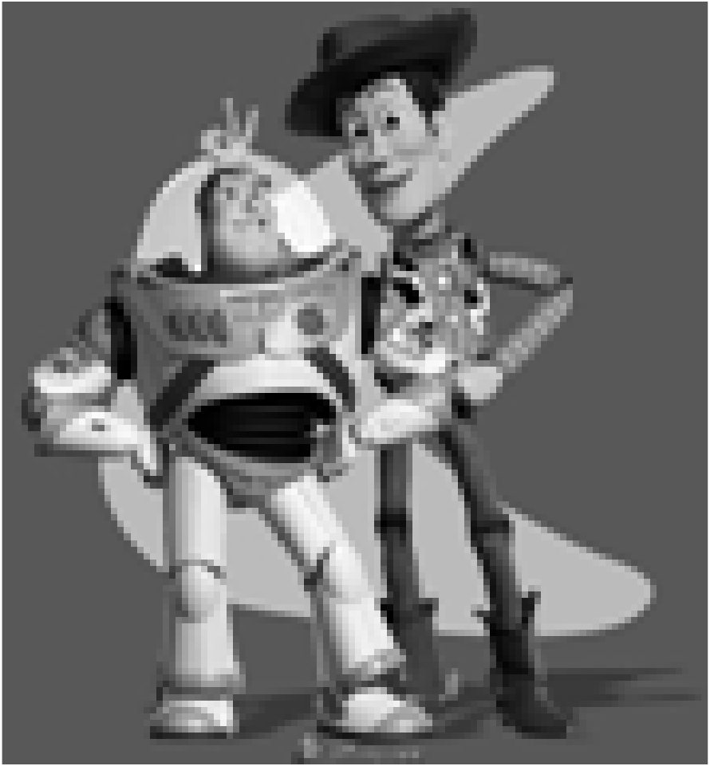
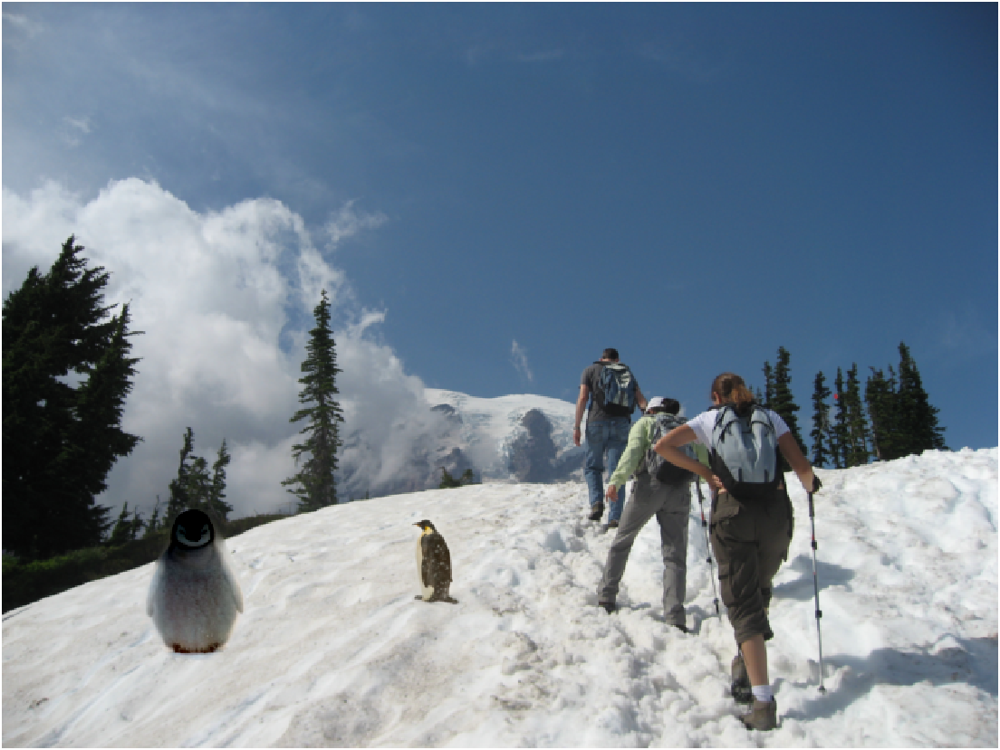
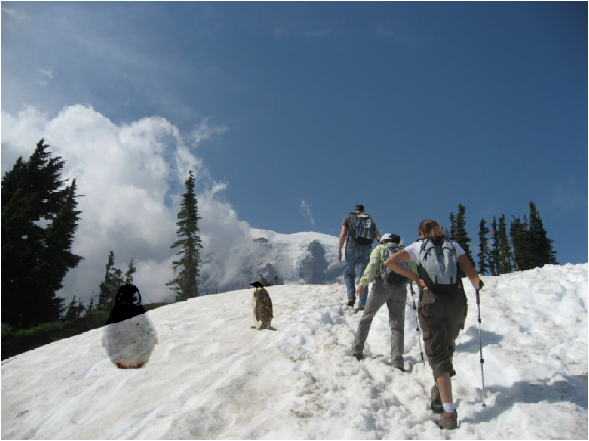

# Assignment 3  
## Implement Poisson Blending  
### Toy problem  

먼저 'toy_problem.png' 파일을 통해 이미지의 gradient를 계산하고,  
이 gradient와 sparse matrix를 통해 원본의 이미지를 reconstruction 하였다.  
아래의 matlab 코드와 같이 코드를 구성하였는데,  
행(height)과 열(width)을 분리하여 width의 앞 뒤 pixel 차를 구하고,  
다음으로 height의 앞 뒤 pixel 차를 구하였다.  
마지막으로 reconstruct하는 이미지와 원본 이미지의 색의 차이를 minimize하기 위해  
sparse matrix와 b의 값을 1로 설정하였다.
```matlab
function output = toy_reconstruct(input)

[height, width, channel] = size(input);
A = sparse(height*(width-1) + (height-1)*width + 1, height*width);
b = zeros(height*width, channel);

im2var = zeros(height, width); 
im2var(1:height*width) = 1:height*width;

e = 0;

for h = 1:height
    for w = 1:(width-1)
        e = e + 1;
        A(e, im2var(h, w+1)) = 1; 
        A(e, im2var(h, w)) = -1;
        b(e) = input(h, w+1) -input(h, w);
    end
end

for h = 1:(height-1)
    for w = 1:(width-1)
        e = e + 1;
        A(e, im2var(h+1,w)) = 1;
        A(e, im2var(h,w)) = -1;
        b(e) = input(h+1, w) - input(h, w);
    end
end

e = e + 1;
A(e, im2var(1, 1)) = 1;
b(e) = input(1, 1);

output = A\b;
output = reshape(output, [height width]);

end
```
원본 이미지와 reconstruction한 이미지의 결과는 아래와 같다.  
error는 0+2.0237e-06i로 약 0의 값을 가진다.  
따라서 원본의 이미지로 reconstruction했다고 할 수 있다.

<table>
    <tr>
        <th>original image</th>
        <th>reconstruct image</th>
    </tr>
    <tr>
        <td></td>
        <td></td>
    </tr>
</table>

### Poisson blending  

이 부분은 두개의 서로 다른 이미지를 붙이며 Poisson blending을 적용한다.  
Poisson은 Laplace operator를 적용시킨 함수의 값이 0이 아닌 다른 수로 결정되는 것을 뜻 한다.  
이를 다시 생각하면 편미분을 하여 이계도함수를 구하는 것과 같다는 것이다.  
편미분을 해서 이계도함수를 구한다는 것을 image에서 생각해본다면  
하나의 pixel이 있을 때, 그 pixel의 이전과 이후의 값에서 현재 pixel의 값을 뺀 것과 같다.  
이러한 image domain에서의 poisson을 생각한다면 아래의 구현한 코드와 같이  
mask에 해당하는 부분은 input의 poisson 값을 가지고 올 수 있다는 것이다.  
그렇기 때문에 sparse matrix에 현재의 값에는 4를 곱하는 것이고  
그 pixel의 height의 앞 뒤, width의 앞 뒤 값을 현재 pixel에서 빼주게 된다.  
그리고 mask에 해당하지 않는 부분은 target의 image를 가져오게 하여  
sparse matrix와 gradient value vector b를 구성하게 된다.
```matlab
function output = poissonBlend(input, mask, target)

[height, width, channel] = size(input);
A = sparse(height*width, height*width);
b = zeros(height*width, channel);

im2var = zeros(height, width); 
im2var(1:height*width) = 1:height*width;

e = 0;

for h = 1:height
    for w = 1:width
        e = e + 1;
        if mask(h,w) == 1
            A(e, im2var(h, w)) = 4;
            A(e, im2var(h, w+1)) = -1;
            A(e, im2var(h, w-1)) = -1;
            A(e, im2var(h+1, w)) = -1;
            A(e, im2var(h-1, w)) = -1;
            b(e, :) = 4 * input(h, w, :) - input(h, w+1, :) - input(h, w-1, :) - input(h+1, w, :) - input(h-1, w, :);
        else
            A(e, im2var(h, w)) = 1;
            b(e, :) = target(h, w, :);
        end
    end
end

output = A\b;
output = reshape(output, [height width channel]);
end
```

<table>
    <tr>
        <th>poisson blending image</th>
    </tr>
    <tr>
        <td></td>
    </tr>
</table>

### Blending with mixed gradients  

이 부분은 source와 target의 gradient의 절대값 중 더 큰 값을 gradient로 사용하는 mixed gradients이다.  
모두 총 4가지 방향의 gradient를 계산하기 때문에,  
각각의 방향에서의 gradient 절대값들이 source와 target 중 더 큰 값을 적용해주어야 한다.  
그렇기 때문에 4방향의 gradient를 모두 비교하여 그 중 큰 값을 사용하도록 하였다.
```matlab
function output = mixedBlend(input, mask, target)

[height, width, channel] = size(input);
A = sparse(height*width, height*width);
b = zeros(height*width, channel);

im2var = zeros(height, width); 
im2var(1:height*width) = 1:height*width;

e = 0;

for h = 1:height
    for w = 1:width
        e = e + 1;
        if mask(h,w) == 1
            A(e, im2var(h, w)) = 4; 
            A(e, im2var(h, w+1)) = -1;
            A(e, im2var(h, w-1)) = -1;
            A(e, im2var(h+1, w)) = -1;
            A(e, im2var(h-1, w)) = -1;
            
            if abs(input(h, w, :) - input(h, w+1, :)) > abs(target(h, w, :) - target(h, w+1, :))
                width_plus_gradient = input(h, w, :) - input(h, w+1, :);
            else
                width_plus_gradient = target(h, w, :) - target(h, w+1, :);
            end
            
            if abs(input(h, w, :) - input(h, w-1, :)) > abs(target(h, w, :) - target(h, w-1, :))
                width_minus_gradient = input(h, w, :) - input(h, w-1, :);
            else
                width_minus_gradient = target(h, w, :) - target(h, w-1, :);
            end
            
            if abs(input(h, w, :) - input(h+1, w, :)) > abs(target(h, w, :) - target(h+1, w, :))
                height_plus_gradient = input(h, w, :) - input(h+1, w, :);
            else
                height_plus_gradient = target(h, w, :) - target(h+1, w, :);
            end
            
            if abs(input(h, w, :) - input(h-1, w, :)) > abs(target(h, w, :) - target(h-1, w, :))
                height_minus_gradient = input(h, w, :) - input(h-1, w, :);
            else
                height_minus_gradient = target(h, w, :) - target(h-1, w, :);
            end
            
             b(e, :) = width_plus_gradient + width_minus_gradient + height_plus_gradient + height_minus_gradient;
            
        else
            A(e, im2var(h, w)) = 1;
            b(e, :) = target(h, w, :);
        end
    end
end

output = A\b;
output = reshape(output, [height width channel]);
end
```

<table>
    <tr>
        <th>mixed gradients blending image</th>
    </tr>
    <tr>
        <td></td>
    </tr>
</table>

### Your own examples
