# Assignment 4  
## HDR imaging  
### Use dcraw to convert the RAQ  

먼저 net 형식의 파일을 dcraw.exe를 통해 tiff의 형식으로 바꾸었다.  
사용한 option은 아래와 같다.  
-w: use camera white balance  
-o 1: output colorspace(sRGB)  
-W: Don't automatically brighten the image  
-q 3: Set the interpolation quality high  
-4: linear 16-bit  
-T: write tiff instead of ppm  

아래는 사용 예시이다.  

<table>
    <tr>
        <th>convert nef file to tiff</th>
    </tr>
    <tr>
        <td>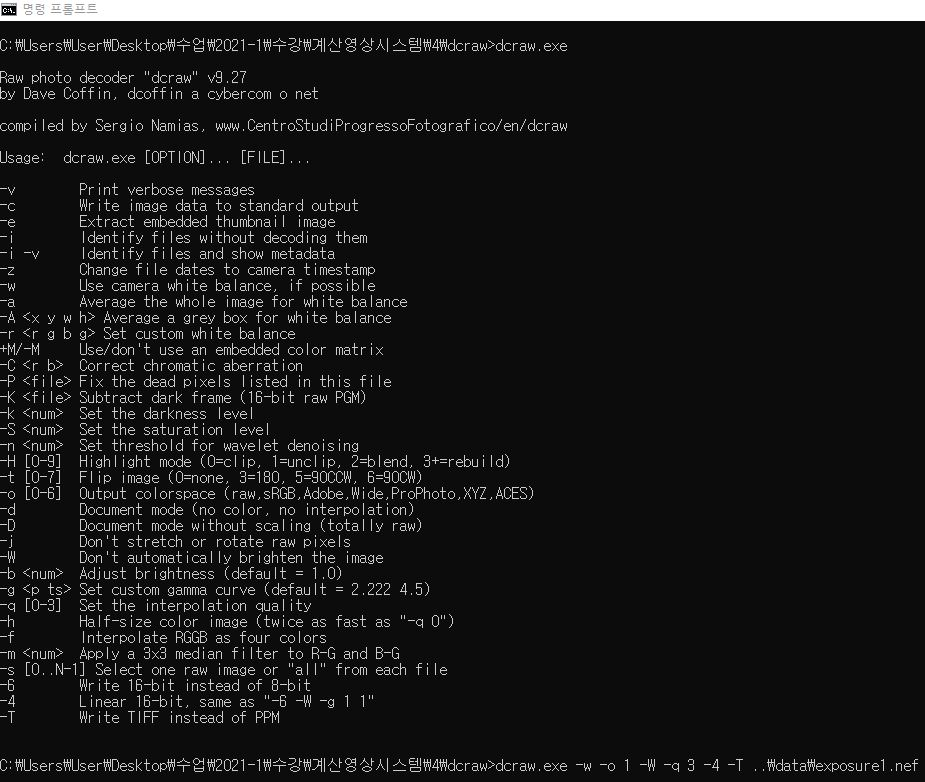</td>
    </tr>
</table>


### Linearize rendered images  

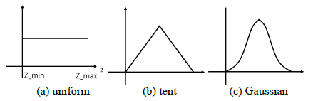

위와 같은 weighting schemes를 이용하여 rendered image(jpg file)을 아래의 식을 통해 최적화하였다.  

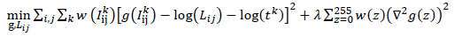

optimize한 결과는 아래의 그래프와 같다.  

<table>
    <tr>
        <th>g curve tent</th>
        <th>g curve uniform</th>
        <th>g curve gaussian</th>
    </tr>
    <tr>
        <td>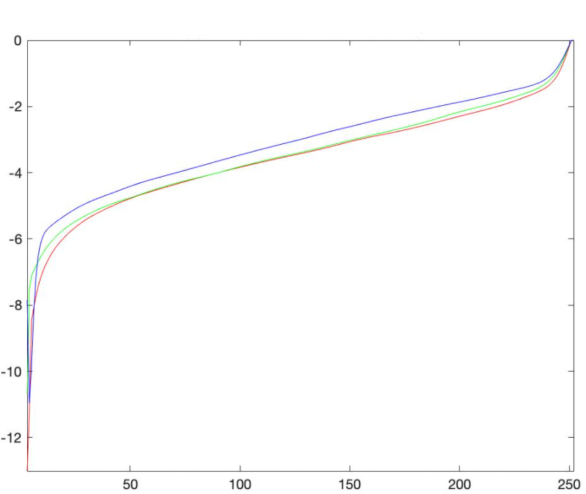</td>
        <td>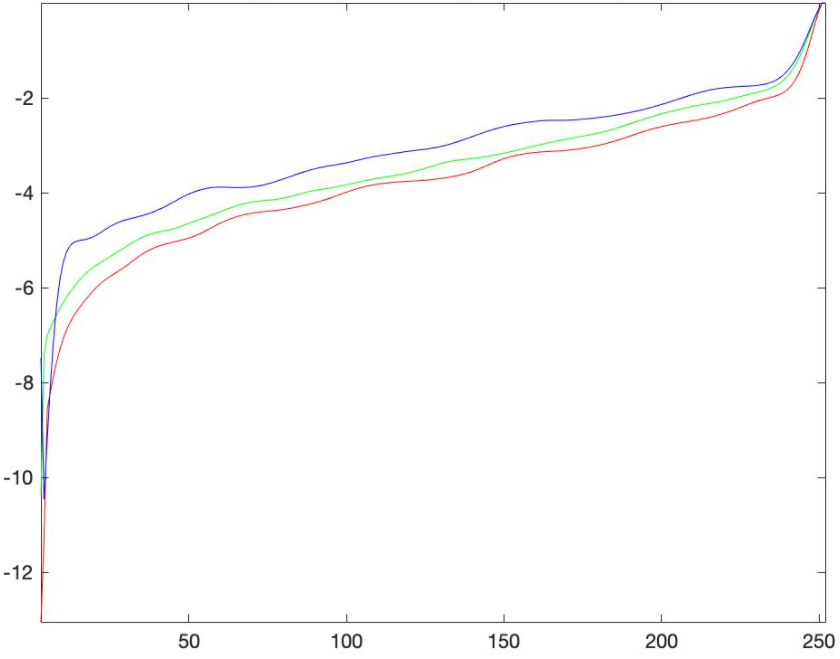</td>
        <td>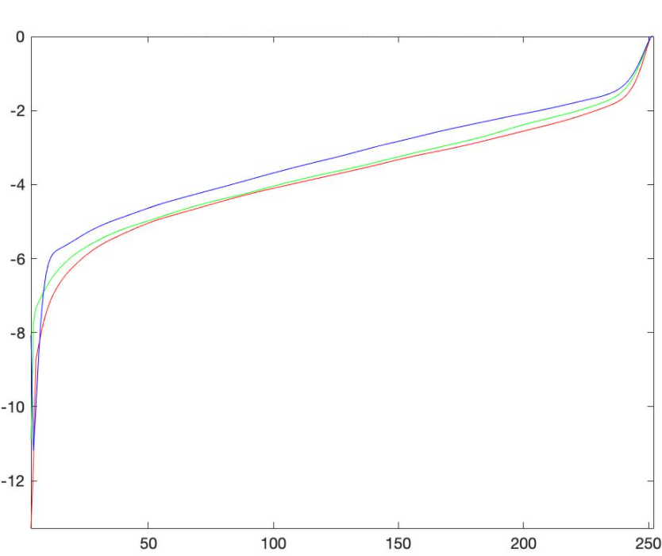</td>
    </tr>
</table>

이를 구현한 코드는 아래와 같다.  
rendered image를 linearize 하는 것이기 때문에 jpg 파일을 이용한다.  

```matlab
clear all;

dummy = imresize(imread('./data/exposure1.jpg'), 0.1);
[height, width, channel] = size(dummy);
num_images = 16;
Z_min = 0; Z_max = 255;
num_Z = Z_max - Z_min + 1;

images = zeros(num_images, height, width, channel);

for i = 1:num_images
    images(i, :, :, :) = imresize(imread(sprintf('./data/exposure%d.jpg', i)), 0.1);
end

red_Z = zeros(height * width, num_images);
green_Z = zeros(height * width, num_images);
blue_Z = zeros(height * width, num_images);

for i = 1:num_images
    red = images(i, :, :, 1);
    green = images(i, :, :, 2);
    blue = images(i, :, :, 3);
    
    red_Z(:, i) = red(:);
    green_Z(:, i) = green(:);
    blue_Z(:, i) = blue(:);
end

exposure = zeros(num_images, 1);
for i = 1:num_images
    exposure(i) = log(power(2, i-1) / 2048);
end

w_tent = zeros(256, 1);
for i = 1:256
    w_tent(i) = -2 * abs(2 * (i - 1) / 255 - 1) + 2;
end

w_uniform = zeros(256, 1);
for i = 1:256
    w_uniform(i) = 1;
end

w_gaussian = zeros(256, 1);
for i = 1:256
    w_gaussian(i) = normpdf((i - 1) / 255, 0.5, 1/6);
end

[red_g_uniform, red_ir_uniform] = optimize(red_Z, exposure, w_uniform);
[green_g_uniform, green_ir_uniform] = optimize(green_Z, exposure, w_uniform);
[blue_g_uniform, blue_ir_uniform] = optimize(blue_Z, exposure, w_uniform);

[red_g_tent, red_ir_tent] = optimize(red_Z, exposure, w_tent);
[green_g_tent, green_ir_tent] = optimize(green_Z, exposure, w_tent);
[blue_g_tent, blue_ir_tent] = optimize(blue_Z, exposure, w_tent);

[red_g_gaussian, red_ir_gaussian] = optimize(red_Z, exposure, w_gaussian);
[green_g_gaussian, green_ir_gaussian] = optimize(green_Z, exposure, w_gaussian);
[blue_g_gaussian, blue_ir_gaussian] = optimize(blue_Z, exposure, w_gaussian);


function [g, ir] = optimize(Z, exposure, weight)
    n = 256; lambda = 1000;
    [Z_height, Z_width] = size(Z);
    A = sparse(Z_height * Z_width + n + 1, n + Z_height);
    b = zeros(size(A, 1), 1);
    
    k = 1;
    for i = 1:Z_height
        for j = 1:Z_width
            w = weight(Z(i, j) + 1);
            A(k, Z(i, j) + 1) = w;
            A(k, n + i) = -w;
            b(k, 1) = w * exposure(j);
            k = k+1;
        end
    end
    
    A(k, 129) = 1;
    k = k+1;
    
    for i = 1:n-2
        A(k, i) = lambda * weight(i + 1);
        A(k, i + 1) = -2 * lambda * weight(i + 1);
        A(k, i + 2) = lambda * weight(i + 1);
        k = k+1;
    end
    
    v = A\b;
    g = v(1:n);
    ir = v(n+1:end);
end
```

### Merge exposure stack to into HDR image  

Raw & rendered / linear & logarithmic / uniform & gaussian 을 사용하였다.  
아래는 exposure stack을 merge하는 code이다.  
rendered image를 처리하는 것은 앞의 문제에서 얻은 결과(linearization)를 사용하였다.  

```matlab
w_uniform = zeros(256, 1);
for i = 1:256
    w_uniform(i) = 1;
end

w_gaussian = zeros(256, 1);
for i = 1:256
    w_gaussian(i) = normpdf((i - 1) / 255, 0.5, 1/6);
end


dummy = imresize(imread('./data/exposure1.tiff'), 0.1);
[raw_height, raw_width, raw_channel] = size(dummy);
uniform_raw_hdr_linear = zeros(raw_height, raw_width, raw_channel);
uniform_raw_hdr_logarithmic = zeros(raw_height, raw_width, raw_channel);
gaussian_raw_hdr_linear = zeros(raw_height, raw_width, raw_channel);
gaussian_raw_hdr_logarithmic = zeros(raw_height, raw_width, raw_channel);
num_images = 16;
Z_min = ceil(0.01 * 255); Z_max = floor(0.99 * 255);
num_Z = Z_max - Z_min + 1;

raw_images = zeros(num_images, raw_height, raw_width, raw_channel);
raw_origin = raw_images;
for i = 1:num_images
    raw_images(i, :, :, :) = im2double(imresize(imread(sprintf('./data/exposure%d.tiff', i)), 0.1));
    raw_origin(i, :, :, :) = uint8(raw_images(i, :, :, :) * 255);
end
raw_images(raw_images > Z_max) = Z_max;
raw_images(raw_images < Z_min) = Z_min;

dummy = imresize(imread('./data/exposure1.jpg'), 0.1);
[rendered_height, rendered_width, rendered_channel] = size(dummy);
uniform_rendered_hdr_linear = zeros(rendered_height, rendered_width, rendered_channel);
uniform_rendered_hdr_logarithmic = zeros(rendered_height, rendered_width, rendered_channel);
gaussian_rendered_hdr_linear = zeros(rendered_height, rendered_width, rendered_channel);
gaussian_rendered_hdr_logarithmic = zeros(rendered_height, rendered_width, rendered_channel);
rendered_origin = zeros(num_images, rendered_height, rendered_width, rendered_channel);
rendered_images = zeros(num_images, rendered_height, rendered_width, rendered_channel);
for i = 1:num_images
    saved_image = load(sprintf('./data/exposure%d.mat', i));
    rendered_images(i, :, :, :) = saved_image.image;
    rendered_origin(i, :, :, :) = imresize(imread(sprintf('./data/exposure%d.jpg', i)), 0.1);
end

exposure = zeros(num_images, 1);
for i = 1:num_images
    exposure(i) = power(2, i-1) / 2048;
end

for h = 1:raw_height
    for w = 1:raw_width
        for c = 1:raw_channel
            uniform_numerator_linear = 0;
            uniform_denominator_linear = 0;
            uniform_numerator_logarithmic = 0;
            uniform_denominator_logarithmic = 0;
            
            gaussian_numerator_linear = 0;
            gaussian_denominator_linear = 0;
            gaussian_numerator_logarithmic = 0;
            gaussian_denominator_logarithmic = 0;
            for i = 1:num_images
                origin = raw_origin(i, :, :, :);
                ldr = raw_images(i, :, :, :);
                Z_ldr = origin(h, w, c);
                Z = ldr(h, w, c);
                
                uniform_numerator_linear = uniform_numerator_linear + w_uniform(Z_ldr + 1) * Z / exposure(i);
                uniform_denominator_linear = uniform_denominator_linear + w_uniform(Z_ldr + 1);
                uniform_numerator_logarithmic = uniform_numerator_logarithmic + w_uniform(Z_ldr + 1) * (log(Z) - log(exposure(i)));
                uniform_denominator_logarithmic = uniform_denominator_logarithmic + wuniform_(Z_ldr + 1);
                
                gaussian_numerator_linear = gaussian_numerator_linear + w_gaussian(Z_ldr + 1) * Z / exposure(i);
                gaussian_denominator_linear = gaussian_denominator_linear + w_gaussian(Z_ldr + 1);
                gaussian_numerator_logarithmic = gaussian_numerator_logarithmic + w_gaussian(Z_ldr + 1) * (log(Z) - log(exposure(i)));
                gaussian_denominator_logarithmic = gaussian_denominator_logarithmic + w_gaussian(Z_ldr + 1);
            end
            if uniform_denominator_linear < 1e-5
                uniform_raw_hdr_linear(h, w, c) = 0;
            else
                uniform_raw_hdr_linear(h, w, c) = exp(uniform_numerator_linear / uniform_denominator_linear);
            end
            if uniform_denominator_logarithmic < 1e-5
                uniform_raw_hdr_logarithmic(h, w, c) = 0;
            else
                uniform_raw_hdr_logarithmic(h, w, c) = exp(uniform_numerator_logarithmic / uniform_denominator_logarithmic);
            end
            if gaussian_denominator_linear < 1e-5
                gaussian_raw_hdr_linear(h, w, c) = 0;
            else
                gaussian_raw_hdr_linear(h, w, c) = exp(gaussian_numerator_linear / gaussian_denominator_linear);
            end
            if uniform_denominator_logarithmic < 1e-5
                gaussian_raw_hdr_logarithmic(h, w, c) = 0;
            else
                gaussian_raw_hdr_logarithmic(h, w, c) = exp(gaussian_numerator_logarithmic / gaussian_denominator_logarithmic);
            end
        end
    end
end

for h = 1:rendered_height
    for w = 1:rendered_width
        for c = 1:rendered_channel
            uniform_numerator_linear = 0;
            uniform_denominator_linear = 0;
            uniform_numerator_logarithmic = 0;
            uniform_denominator_logarithmic = 0;
            
            gaussian_numerator_linear = 0;
            gaussian_denominator_linear = 0;
            gaussian_numerator_logarithmic = 0;
            gaussian_denominator_logarithmic = 0;
            for i = 1:num_images
                origin = rendered_origin(i, :, :, :);
                ldr = rendered_images(i, :, :, :);
                Z_ldr = origin(h, w, c);
                Z = ldr(h, w, c);
                
                uniform_numerator_linear = uniform_numerator_linear + w_uniform(Z_ldr + 1) * Z / exposure(i);
                uniform_denominator_linear = uniform_denominator_linear + w_uniform(Z_ldr + 1);
                uniform_numerator_logarithmic = uniform_numerator_logarithmic + w_uniform(Z_ldr + 1) * (log(Z) - log(exposure(i)));
                uniform_denominator_logarithmic = uniform_denominator_logarithmic + wuniform_(Z_ldr + 1);
                
                gaussian_numerator_linear = gaussian_numerator_linear + w_gaussian(Z_ldr + 1) * Z / exposure(i);
                gaussian_denominator_linear = gaussian_denominator_linear + w_gaussian(Z_ldr + 1);
                gaussian_numerator_logarithmic = gaussian_numerator_logarithmic + w_gaussian(Z_ldr + 1) * (log(Z) - log(exposure(i)));
                gaussian_denominator_logarithmic = gaussian_denominator_logarithmic + w_gaussian(Z_ldr + 1);
            end
            if uniform_denominator_linear < 1e-5
                uniform_rendered_hdr_linear(h, w, c) = 0;
            else
                uniform_rendered_hdr_linear(h, w, c) = exp(uniform_numerator_linear / uniform_denominator_linear);
            end
            if uniform_denominator_logarithmic < 1e-5
                uniform_rendered_hdr_logarithmic(h, w, c) = 0;
            else
                uniform_rendered_hdr_logarithmic(h, w, c) = exp(uniform_numerator_logarithmic / uniform_denominator_logarithmic);
            end
            if gaussian_denominator_linear < 1e-5
                gaussian_rendered_hdr_linear(h, w, c) = 0;
            else
                gaussian_rendered_hdr_linear(h, w, c) = exp(gaussian_numerator_linear / gaussian_denominator_linear);
            end
            if gaussian_denominator_logarithmic < 1e-5
                gaussian_rendered_hdr_logarithmic(h, w, c) = 0;
            else
                gaussian_rendered_hdr_logarithmic(h, w, c) = exp(gaussian_numerator_logarithmic / gaussian_denominator_logarithmic);
            end
        end
    end
end
```

<table>
    <tr>
        <th>uniform / raw / linear</th>
        <th>uniform / raw / logarithmic</th>
        <th>gaussian / raw / linear</th>
        <th>gaussian / raw / logarithmic</th>
    </tr>
    <tr>
        <td></td>
        <td>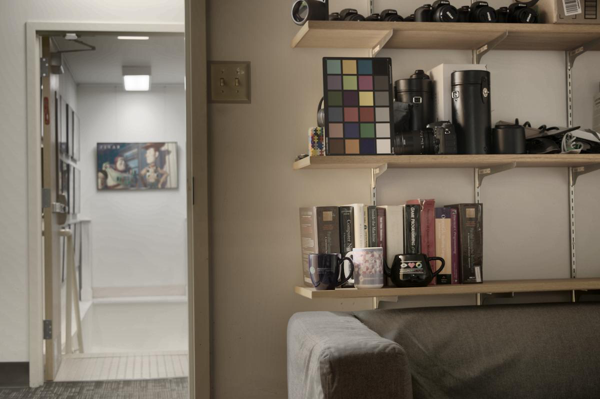</td>
        <td>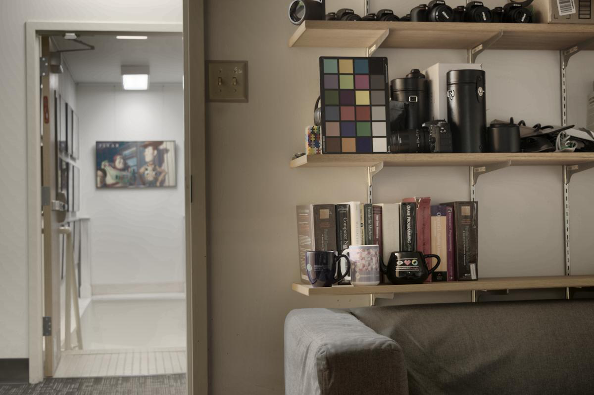</td>
        <td></td>
    </tr>
</table>

<table>
    <tr>
        <th>uniform / rendered / linear</th>
        <th>uniform / rendered / logarithmic</th>
        <th>gaussian / rendered / linear</th>
        <th>gaussian / rendered / logarithmic</th>
    </tr>
    <tr>
        <td>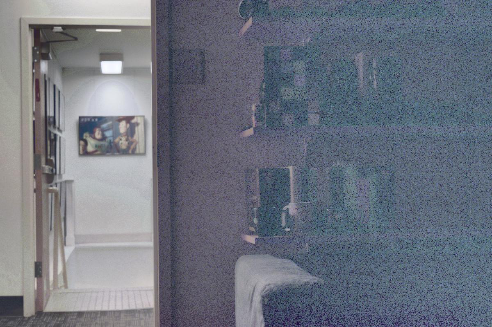</td>
        <td>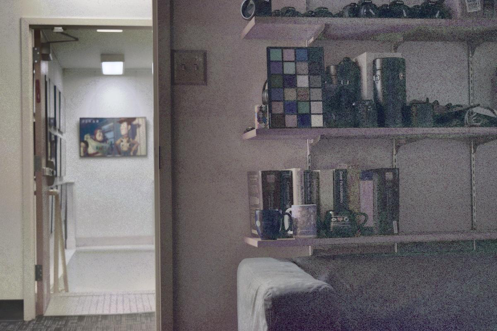</td>
        <td>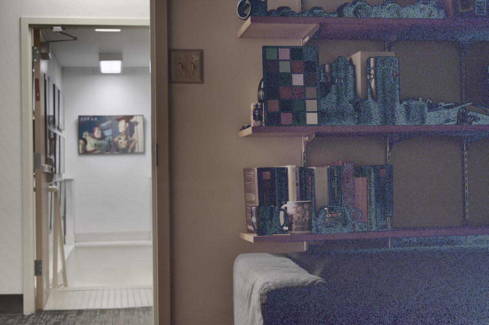</td>
        <td>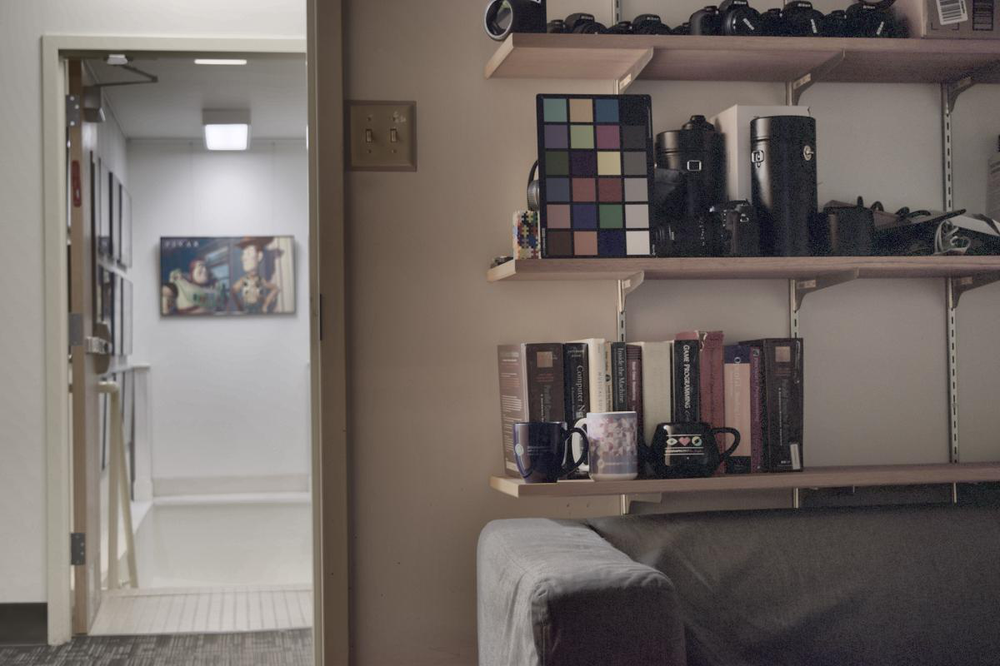</td>
    </tr>
</table>

위의 결과를 확인하였을 때, 전체적으로 raw file의 결과가 좋았다.  
rendered file의 linear 경우는 gaussian이나 uniform 다 열화가 심한 것을 확인할 수 있었다.  
