# Assignment 5  
## Light field rendering, focal stacks, and depth from defocus  
### Initials  

먼저 주어진 plenoptic image는 16 by 16의 aperture domain을 가지고 있다.  
따라서 light field를 (16, 16, 400, 700, 3)의 크기를 가지도록 주었다.  
이때 400과 700은 주어진 plenoptic image의 height와 width를 aperture domain의 크기로 나눈 숫자이다.  

아래와 같은 code를 통해 light field를 plenoptic image로부터 구성하였다.  

```matlab
img = im2double(imread('./chessboard_lightfield.png'));
[h, w, c] = size(img);
u = 16; v = 16; s = h/u; t = w/v;
light_field = zeros(u, v, s, t, c);
for s_ = 1:s
    for t_ = 1:t
        for u_ = 1:u
            for v_ = 1:v
                for c_ = 1:c
                    light_field(u_, v_, s_, t_, c_) = img(u * (s_ - 1) + u_, v * (t_ - 1) + v_, c_);
                end
            end
        end
    end
end
```


### Sub-aperture views  

앞의 light field를 통해 mosaic image를 구성하였다.  
아래는 이를 수행하는 code이다.

```matlab
mosaic = zeros(h, w, c);
for u_ = 1:u
    for v_ = 1:v
        mosaic(s * (u_ - 1) + 1 : s * (u_ - 1) + s, t * (v_ - 1) + 1 : t * (v_ - 1) + t, :) = light_field(u_, v_, :, :, :);
    end
end
```

위의 코드의 결과는 아래와 같다.  

<table>
    <tr>
        <th>mosaic of sub-aperture views</th>
    </tr>
    <tr>
        <td>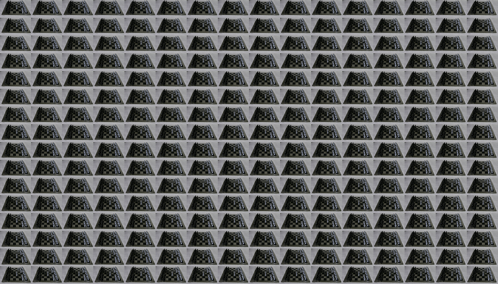</td>
    </tr>
</table>


### Refocusing and focal-stack generation  

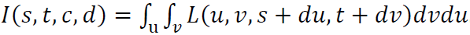

위의 식을 이용하여 d에 따른 refocusing을 진행하였다.  
depth cells를 통해 focal stack을 저장하였다.  
아래는 이를 수행하는 code이다.  

```matlab
depth_cells{21} = {};
idx = 0;
for d = 0:0.1:2
    idx = idx + 1;
    depth = zeros(s, t, c);
    for s_ = 1:s
        for t_ = 1:t
            sum = 0;
            for u_ = (1 - u/2):(u/2)
                for v_ = (1 - v/2):(v/2)
                    i = round(s_ + u_ * d);
                    j = round(t_ - v_ * d);
                    if (i >= 1 && i <= s) && (j >= 1 && j <= t)
                        for c_ = 1:c
                            depth(s_, t_, c_) = depth(s_, t_, c_) + light_field(u_ + u/2,v_ + v/2, i, j, c_);
                        end
                    sum = sum + 1;
                    end
                end
            end
            depth(s_, t_, :) = depth(s_, t_, :) / sum;
        end
    end
    depth_cells{idx} = depth;
end
```

아래는 refocusing한 결과를 보여주기 위해 image를 가져왔다.  
depth의 값이 0, 0.5, 1, 1.5, 2일 때의 결과이다.  

<table>
    <tr>
        <th>depth = 0</th>
        <th>depth = 0.5</th>
        <th>depth = 1</th>
        <th>depth = 1.5</th>
        <th>depth = 2</th>
    </tr>
    <tr>
        <td>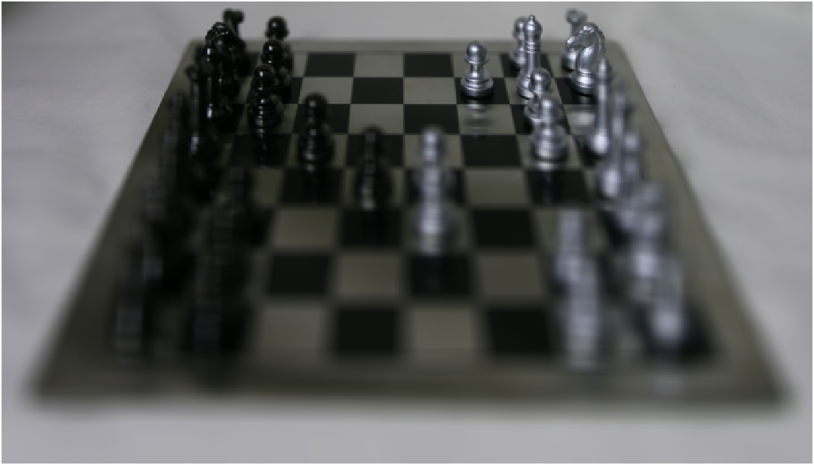</td>
        <td>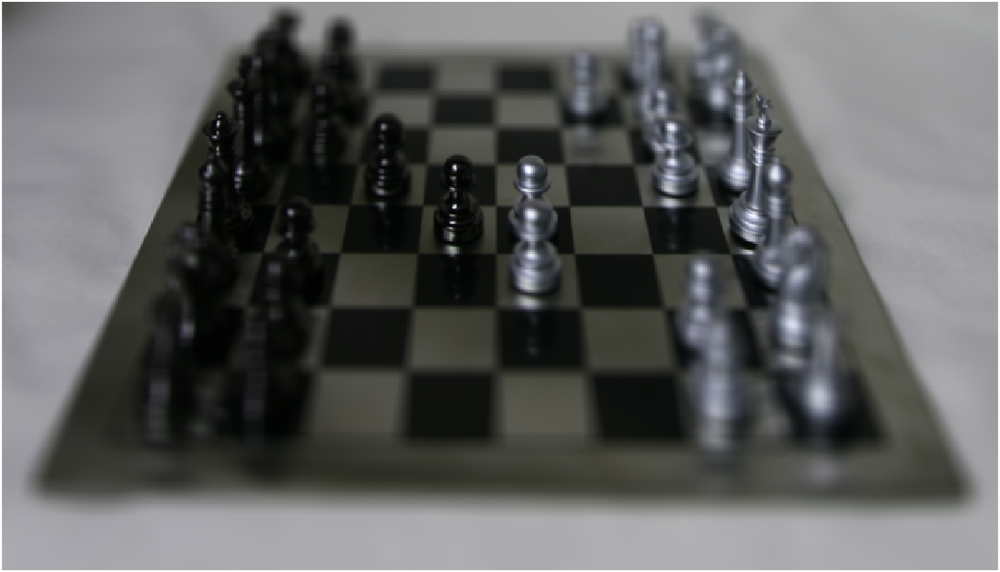</td>
        <td>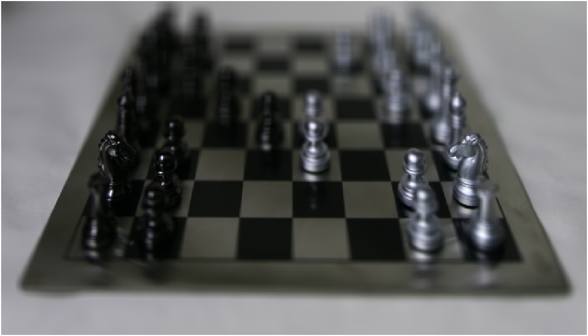</td>
        <td>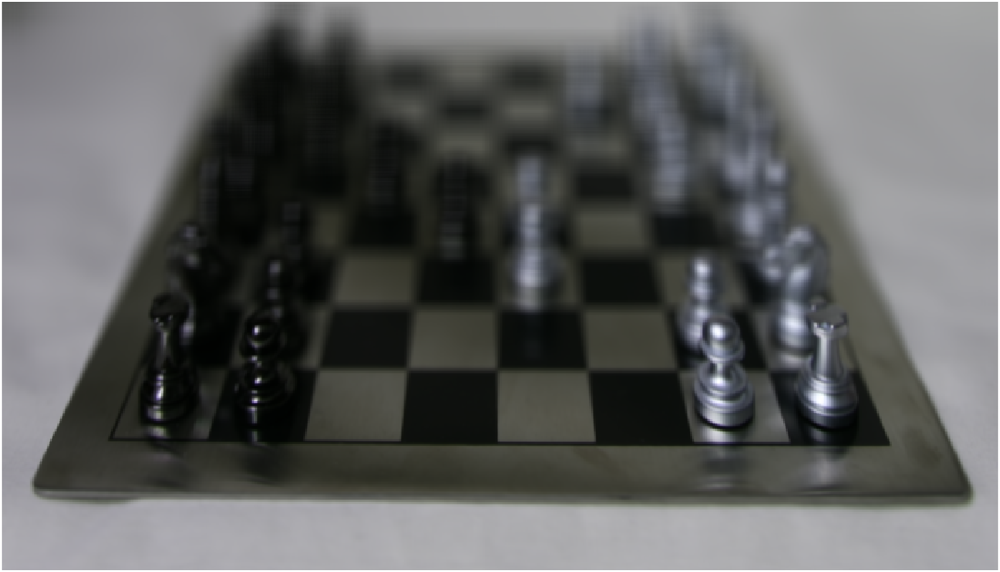</td>
        <td>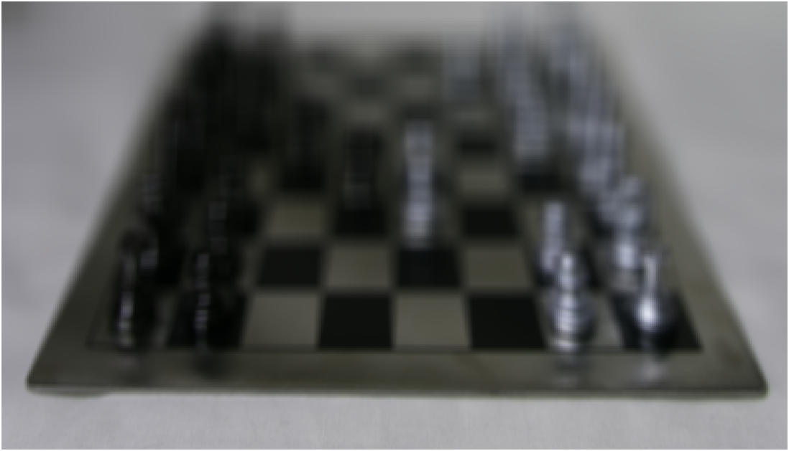</td>
    </tr>
</table>

위의 결과를 확인하였을 때, depth에 따라서 이미지의 초점이 달라지는 것을 확인할 수 있었다.  


### All-focus image and depth from defocus  

All-focus image와 depth image를 얻기 위해 먼저 depth에 따른 sharpness를 구하여야 한다.  
그렇기 때문에 아래의 식들을 통해 depth에 따른 luminance를 구하고,  
이와 gaussian kernel을 사용하여 low frequency image를 구하였다.  
이렇게 구한 low frequency image를 luminance에서 빼서 high frequency를 구하고,  
이와 gaussian kernel을 이용하여 sharpness map을 구하였다.  

이때 low frequency를 구할 때 사용한 gaussian kernel의 sigma1는 2.5를 사용하였고,  
sharpness map을 구할 때 사용한 gaussian kernel의 sigma2는 5를 사용하였다.  

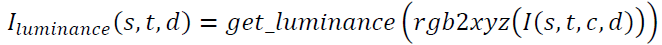
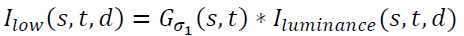
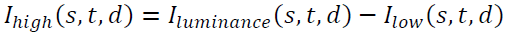
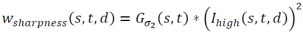

그렇게 sharpness map을 구한 뒤, image의 모든 depth에 focus가 맞춰진 all focus 이미지와 depth 이미지를 아래의 식들을 통해 구하였다.  

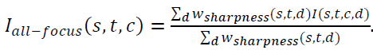
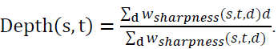

아래는 이를 구현한 code이다.  

```matlab
lum_cells{21} = {};
low_cells{21} = {};
high_cells{21} = {};
sharp_cells{21} = {};

for d = 1:21
    xyz_depth = rgb2xyz(depth_cells{d}, 'ColorSpace', 'srgb');
    lum_cells{d} = xyz_depth(:, :, 2);
    low_cells{d} = imgaussfilt(lum_cells{d}, 2.5);
    high_cells{d} = lum_cells{d} - low_cells{d};
    sharp_cells{d} = imgaussfilt(high_cells{d}.^2, 5);
end

all_focus = zeros(s, t, c);
depth_gray = zeros(s, t);
 for s_ = 1:s
     for t_ = 1:t
        w = 0;
        for d = 1:21
            for c_ = 1:c
                all_focus(s_, t_, c_) = all_focus(s_, t_, c_) + depth_cells{d}(s_, t_, c_) * sharp_cells{d}(s_, t_);
            end
            depth_gray(s_, t_) = depth_gray(s_, t_) + d * sharp_cells{d}(s_, t_);
            w = w + sharp_cells{d}(s_, t_);
        end
        all_focus(s_, t_, :) = all_focus(s_, t_, :) / w;
        depth_gray(s_, t_) = depth_gray(s_, t_) / w;
     end
 end
```

아래는 위의 code를 통해 얻은 all focus 이미지와 depth 이미지이다.  

<table>
    <tr>
        <th>all focus image</th>
        <th>depth map</th>
    </tr>
    <tr>
        <td>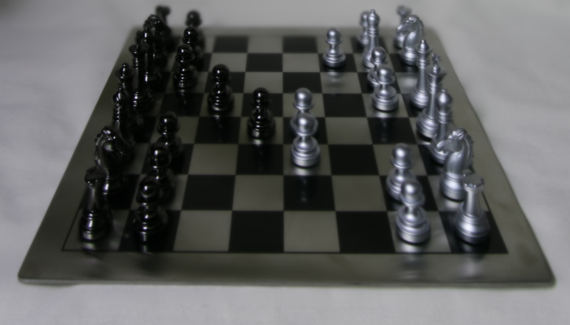</td>
        <td>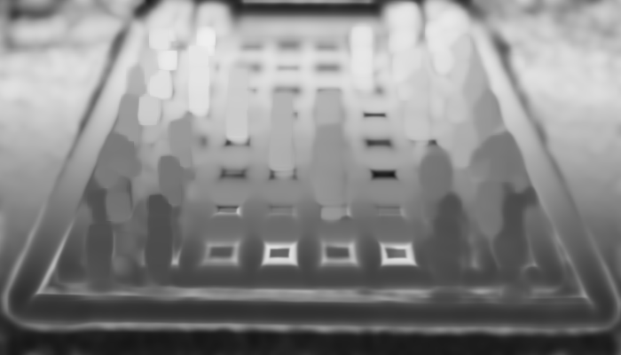</td>
    </tr>
</table>
